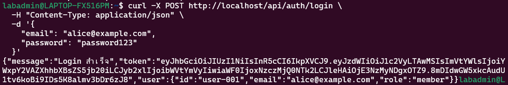
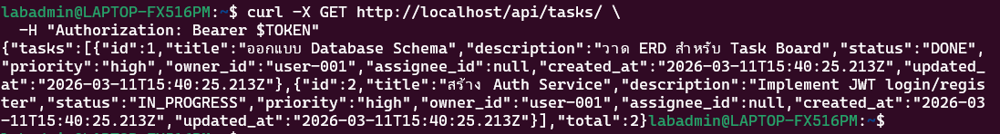

# สรุปผลการทดลอง Week 12: Security Architecture Analysis

## ผลการทดสอบระบบของโปรเจกต์นี้

### กรณีที่ 1: ❌ เข้าใช้งาน Protected API แต่ไม่แนบ Token
**ผลที่ได้:**
- **รหัสข้อผิดพลาด:** `401 Unauthorized`
- **ตรงตามที่คิดไว้หรือไม่:** ตรงตามที่ออกแบบไว้
- **เหตุผลที่แท้จริง:** โค้ดส่วน API Gateway ผนวกกับ Middleware ของ Service ถูกตั้งค่าให้มีการเช็ค Token ที่รับมาทาง `Authorization` Header ทันที ถ้าพบความว่างเปล่าหรือไม่มีการแนบ Token ใดๆ ระบบจะทำการตัดและไม่ให้เข้าถึง resource นั้นๆ ทันที

---

### กรณีที่ 2: ✅ การสร้างผู้ใช้งานใหม่ (Register) และการเข้าสู่ระบบ (Login)

---

### กรณีที่ 3: ✅ เรียกดูข้อมูลส่วนตัวจาก Protected API พร้อมส่ง Token
**ผลที่ได้:** 
- **จำนวนรายการ Task ที่พบ:** 2 รายการ
- **รูปแบบของ Task ที่มองเห็น:** เห็นแค่ Task ที่ผู้ใช้นั้นๆ (เช่น `user-001`) เป็นเจ้าของเท่านั้น ผู้อื่นจะไม่สามารถเห็นได้
- **เหตุผลที่แท้จริง:** ระบบ Backend ในส่วนของ Task Service ได้นำเอาข้อมูล Claim (ที่อยู่ภายใน Payload ของ JWT เช่น user_id หรือ sub) มาระบุเป็นเงื่อนไขในการค้นหาฐานข้อมูล (`WHERE owner_id = $1`) นี่จึงเป็นเหตุผลว่าหากผู้ใช้ไม่ได้เป็นแอดมิน จะสามารถมองเห็นเฉพาะข้อมูลของตัวเองได้เท่านั้น

---

### กรณีที่ 4: ❌ การใช้งาน Token ที่หมดอายุไปแล้ว หรือปลอมแปลง Token
**ผลที่ได้:** 
- **ผลสะท้อนจากการทดลอง:** สิทธิ์จะถูกปฏิเสธและขึ้นข้อความแจ้งว่า `401 Invalid Token` เสมอ
- **การทำงานของ JWT Signature ที่ทำให้การโจมตีไม่สำเร็จ:** ชุดข้อมูล JWT มี 3 ส่วนคือ Header, Payload และ Signature โดย Signature นั้นเกิดจากการเข้ารหัสผสมร่วมระหว่าง Header + Payload บวกด้วย Secret Key ลับที่อยู่กับฝั่ง Backend เท่านั้น ดังนั้นหากใครก็ตามนำเอา Token ไปแก้ไข Payload (เช่น แก้ Role ตัวเองให้เป็น Admin) ตัว Signature เดิมที่มีอยู่นั้นจะไม่ตรงกับ Secret Key ทางฝั่ง Backend อีกต่อไป ทำให้ API ปฏิเสธการเปลี่ยนแปลงนั้นได้

---

### กรณีที่ 5: ❌ การแก้ไขหรือลบข้อมูลของผู้อื่นโดยไม่มีสิทธิ์
**ผลที่ได้:** 
- **ข้อผิดพลาดที่ตอบกลับมา:** `403 Forbidden`
- **ความแตกต่างของการยืนยันตัวตน (Authentication) และการอนุญาตสิทธิ (Authorization):** 
  - **Authentication:** การยืนยันได้ว่า "คุณคือใคร" (มี Token จริงและเข้าสู่ระบบแล้ว จึงได้คะแนนผ่านด่าน `401`)
  - **Authorization:** การยืนยันได้ว่า "คุณมีสิทธิ์ทำสิ่งนี้หรือไม่" (คุณเป็นผู้ใช้งานทั่วไปที่พยายามแอบไปลบข้อมูลที่ไม่ได้เป็นเจ้าของตัวเอง ดังนั้นจึงไม่ได้รับสิทธิ์และติด `403`)

---

### กรณีที่ 6: ✅ บทบาทของผู้ดูแลระบบ (Admin)
**ผลที่ได้:** 
- **มุมมองของ Admin:** เห็นรายการ Task ของระบบได้ทั้งหมด (จำนวน 4 รายการ)
- **มุมมองของ User ปรกติ:** จะเห็นเพียงแค่ Task ตัวเองเท่านั้น (จำนวน 2 รายการ)
- **หน้า API สำรอง (`/api/users/`):** ผู้ใช้งานปรกติไม่สามารถเข้าถึงได้และจะเด้ง `403 Forbidden`
- **ความรู้เรื่องระบบ RBAC (Role-Based Access Control):** ภายในตัวของ JWT Token จะมี Payload ที่แปะป้ายให้ว่าคนผู้นั้นเป็นใคร (Role Claim) เพื่อให้ Middleware ใช้แสกนสิทธิ์ เช่น เช็คว่าคนคนนั้นมีสิทธิ์ระดับ `admin` หรือไม่ หากไม่ได้เป็นตัวของ Controller API ก็จะทำการปฏิเสธทันที

---

### กรณีที่ 7: ❌ การป้องกันการโจมตีสุ่มรหัส (Rate Limiting)
**ผลที่ได้:** 
- **จำนวนครั้งที่ระบบเริ่มต้นแบน (429):** เกิดขึ้นที่ครั้งที่ 5 เป็นต้นไป (ครั้งแรกๆ จะยังคงได้ข้อผิดพลาด `401`)
- **ผลประโยชน์ของ Rate Limiting:** ช่วยกันระบบฐานข้อมูลหรือ API ล่มจากการที่ Hacker สุ่มยิง Request เป็นจำนวนมากๆ แบบ Brute-force หรือ DoS (Denial of Service) 
- **ความท้าทายของ Rate Limiting แบบ IP:** หากมีการแชร์ IP (เช่น ผู้ใช้จาก Office หรือมหาลัยเดียวกัน) แล้วมีคนนึงโดนแบนจาก Rate Limit การแบนอาจจะครอบคลุมถึงคนที่ใช้งาน IP เดียวกันทั้งหมดได้ทำให้การใช้งานกระทบกันหมด

---

### กรณีที่ 8: 🔍 ความพยายามในการโจมตีแบบ SQL Injection
**ผลที่ได้:** 
- **ปฏิกิริยาของระบบตอบสนอง:** รหัสผ่านและการล็อกอินผิดพลาดแบบปกติ (`401`) ระบบไม่ได้รับความเสียหายแต่อย่างใด
- **สาเหตุที่รอดจากการโจมตีได้ด้วย Parameterized Query:** เนื่องจากการเขียนโค้ดเพื่อต่อฐานข้อมูลผ่านเครื่องมืออย่าง `pg` โดยใช้การเชื่อมตัวแปรแบบ Parameterized (เช่น `$1`, `$2`) นั้น ตัวฐานข้อมูลจำกำหนดให้มันเป็นเพียงแค่ค่า Data เท่านั้น ทำให้มันไม่ได้ถูกมองว่าเป็นคำสั่งหรือ Command Query แต่อย่างใด ส่งผลให้การโจมตีหรือการหลอกคำสั่ง SQL ไม่ทำงาน

---

## ตารางสรุปภาพรวม

| เรื่องที่ทำการทดสอบ | สภาพที่ควรจะเป็น | สภาพที่เกิดขึ้นจริง | ผ่าน (✅)/ไม่ผ่าน (❌) | คำอธิบายเพิ่มเติม |
|-----------|----------|--------|------|---------|
| 1. พยายามทะลวงระบบรหัสแบบไม่มี Token | 401 | 401 | ✅ | ระบบเบิกความถูกต้องผ่าน Middleware ตามปรกติ |
| 2. สมัครใช้งานและล็อกอิน | 200 + Token | 200 + Token | ✅ | ล็อกอินผ่านฉลุย ได้เหรียญ Token มาครอบครอง |
| 3. การเข้าถึงที่ข้อมูลของตัวเอง | 200 + data | 200 + data | ✅ | ตัวแอพสามารถดึงข้อมูลของคนที่ถือ Token ได้อย่างแม่นยำ |
| 4. ใช้ Token เทียมหรือ Token เก่า | 401 | 401 | ✅ | ระบบเตะออกเพราะรู้ทันว่า Digital Signature เปลี่ยนรูปหรือผิดเพี้ยน |
| 5. พยายามจุ้นจ้านแก้ไขงานของคนอื่น (Forbidden) | 403 | 403 | ✅ | ระบบสั่งห้ามไม่ให้ผู้ใช้ปรกติมีอำนาจไปวุ่นวายกับรายการคนอื่น |
| 6. อำนาจสูงสุดของ Admin | 200 | 200 | ✅ | Admin ทักทายทุก Task งานได้เต็มระบบ |
| 7. ทดสอบการรัวรีเควสแบบปืนกล (Rate Limit) | 429 | 429 | ✅ | API Gateway อย่าง Nginx ไม่ยอมใจอ่อน ตบเข้าด่าน 429 ครบสูตร |
| 8. สุ่มคำสั่งเพี้ยนๆ เพื่อหมายแทง SQL Injection | Safe | Safe | ✅ | โครงสร้าง Database กันไว้อย่างแน่นหนาด้วย Parameterized Queries |
